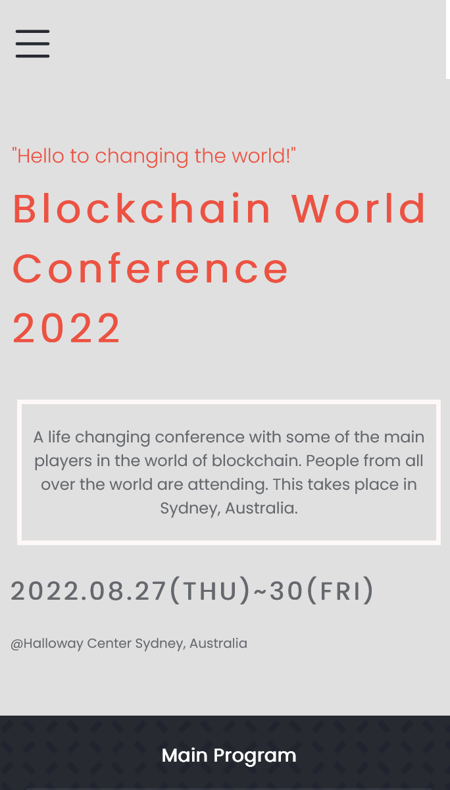
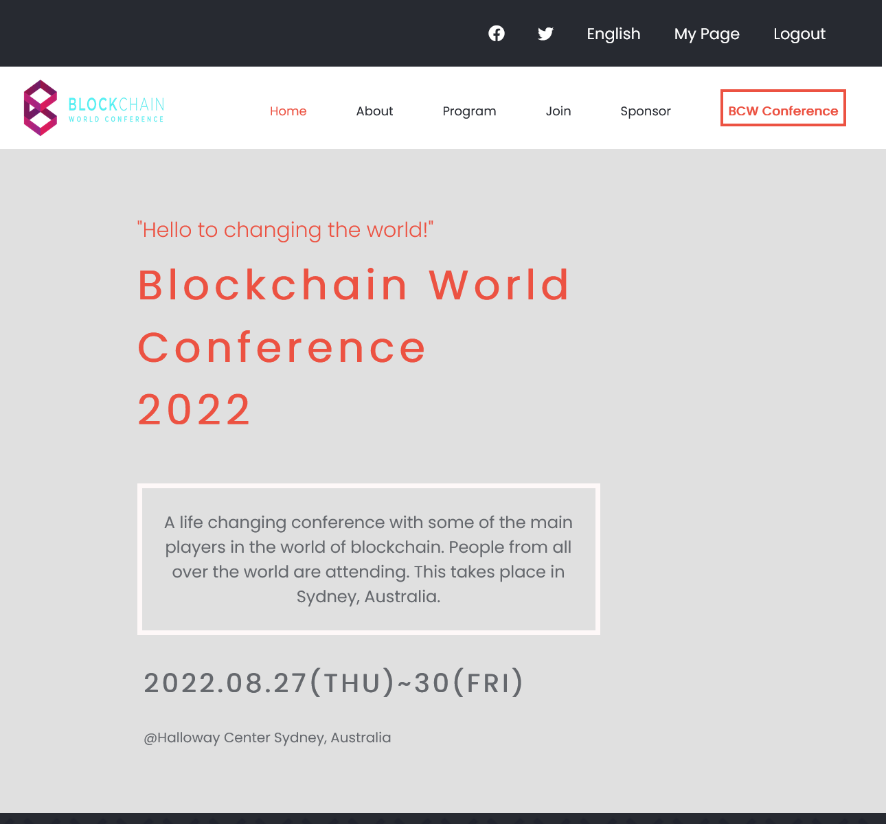

## Capstone-project-1
This is my first capstone project in the microverse curriculum. It tests all the knowledge I have gained in HTML, CSS and Javascript. I am a blockchain enthusiast so I made the theme of the website an online blockchain conference. Below I have shown a screenshot of what the home-page tooks like.

.

 

## Built With

- HTML & CSS
- Javascript
- Github

## Live Demo 

Click [here](https://TracyMuso.github.io/Capstone-project-1/) for the live demo

### To get a local copy up and running follow these simple example steps.

# Prerequisites

- Github flow knowledge. -Intermediate CSS, HTML and Javascript. -Installation of linter files.
- Use of the [Behance](https://www.behance.net/gallery/29845175/CC-Global-Summit-2015) template 

# Setup 
- To clone the repository run [https://github.com/TracyMuso/Capstone-project1] in your terminal

# Install
- Set up Github Actions
- Set up linter > Lighthouse , Webhint ,Stylelint , Eslint.

## Author

👤 **Tracy Musongole**

- GitHub: [@githubhandle](https://github.com/TracyMuso)
- Twitter: [@twitterhandle](https://twitter.com/tracy_muso)
- LinkedIn: [LinkedIn](https://linkedin.com/in/tracy-muso)

## 🤝 Contributing

Contributions, issues, and feature requests are welcome!

Feel free to check the [issues page](https://github.com/TracyMuso/Capstone-project-1/issues).

## Show your support

Give a ⭐️ if you like this project!

## Acknowledgments

- Hat tip to anyone whose code was used
- Credit to [Cindy Shin on behance](https://www.behance.net/adagio07) , my web design is inspired by her [project](https://www.behance.net/gallery/29845175/CC-Global-Summit-2015).
- Credit to [Junik Studio on behance](https://www.behance.net/JunikStudio) , their cryptocurrency icons were used in the making of this project
- Good old uncle Google
-My learning partners for this week.

## 📝 License

This project is [MIT](./LICENSE) licensed.
